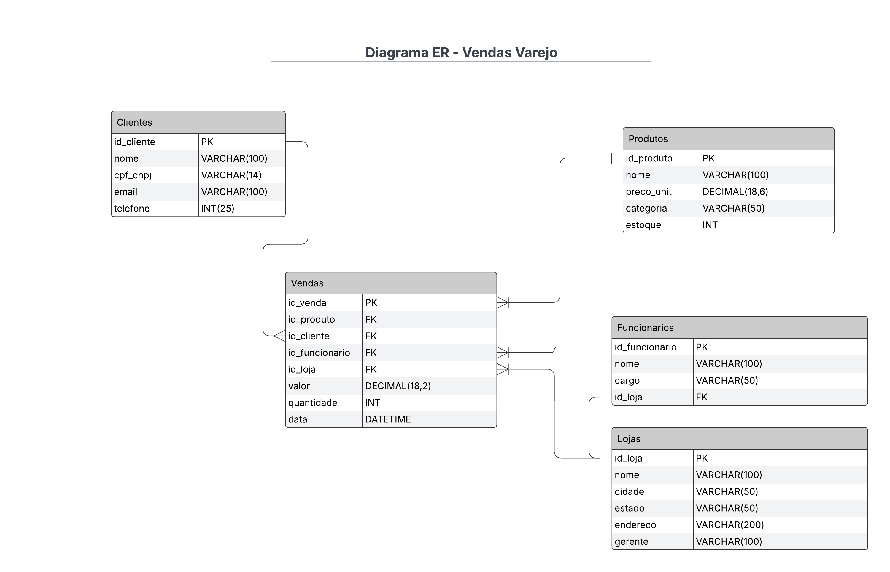
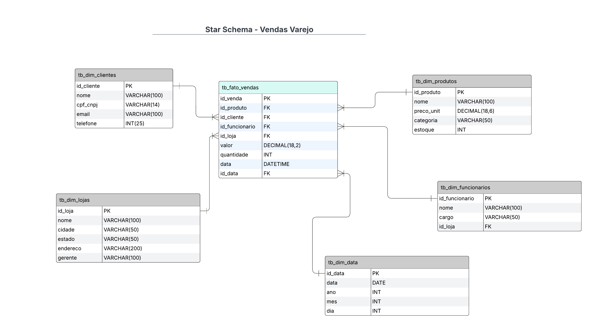

# Vendas Varejo

- [Cenário](#cenário)
    - [Requisitos Específicos](#requisitos-específicos)
    - [Tarefa](#tarefa)
    - [Entregáveis](#entregáveis)

- [Solução](#solução)
    - [Modelo ER](#modelo-er)
    - [Star Schema](#star-schema)
    - [Descrição](#descrição)
    - [Transformação ER em Star Schema](#transformação-er-em-star-schema)

## Cenário

3) Cenário 
Você é um analista de dados que foi encarregado de otimizar o armazenamento de dados para análises de vendas de uma grande rede de varejo. A empresa possui 
um sistema de banco de dados relacional tradicional, com um modelo EntidadeRelacionamento (ER) que inclui as seguintes entidades principais: Produtos, 
Vendas, Clientes, Funcionários e Lojas. 

### Requisitos Específicos

- **Produtos**: Armazena informações sobre os produtos vendidos, incluindo ID do Produto, Nome, Categoria, Preço Unitário e Estoque.
- **Vendas**: Registra cada venda, incluindo ID da Venda, ID do Produto, ID do Cliente, ID do Funcionário, ID da Loja, Data da Venda, Quantidade e Valor Total.
- **Clientes**: Contém dados dos clientes, como ID do Cliente, Nome, E-mail e Telefone.
- **Funcionários**: Mantém informações sobre os funcionários, incluindo ID do Funcionário, Nome, Cargo e ID da Loja em que trabalham.
- **Lojas**: Detalha as lojas da rede, com ID da Loja, Nome, Localização e Gerente.

### Tarefa

A partir do modelo ER fornecido, desenvolva um Star Schema para otimizar as análises de vendas da empresa.

### Entregáveis

- Um diagrama do Star Schema, identificando claramente a tabela de fatos e as dimensões
- Uma breve descrição de cada tabela
- Explique brevemente como você transformou o modelo ER em um Star Schema, destacando as decisões de design mais importantes

---

## Solução

### Modelo ER

### Star Schema

### Descrição

- **Tabela Fato (tb_fato_vendas)**:  
Tabela central contendo métricas quantitativas das vendas realizadas. Inclui informações essenciais para análise como ID da venda, quantidade vendida, valor total, além de chaves estrangeiras para dimensões relacionadas (produto, cliente, funcionário, loja e tempo).

- **Dimensões**:
  - **tb_dim_produtos**: Armazena informações detalhadas dos produtos, como nome, categoria e preço unitário. Ajuda a compreender quais itens geram mais vendas.
  - **tb_dim_clientes**: Registra informações dos clientes (nome, CPF/CNPJ, e-mail, telefone), permitindo análises sobre o comportamento de consumo dos clientes.
  - **tb_dim_funcionarios**: Guarda informações dos funcionários (nome, cargo, loja vinculada), permitindo análise da performance de vendas por funcionário.
  - **tb_dim_lojas**: Contém informações sobre cada loja (nome, localização, gerente), permitindo avaliar desempenho por unidade.
  - **tb_dim_data**: Fornece contexto temporal detalhado das vendas (data completa, ano, mês e dia), permitindo análises temporais detalhadas.

### Transformação ER em Star Schema

Para transformar o modelo ER original em um Star Schema, eu reorganizei as tabelas originais considerando um modelo dimensional, ideal para consultas analíticas rápidas e eficientes:

- **Seleção da Tabela Fato**:  
  Escolhi a tabela de **Vendas** para ser a tabela central (**Fato**) contendo as medidas quantitativas (quantidade, valor das vendas) essenciais para análises.

- **Criação das Dimensões**:  
  As tabelas que fornecem contexto qualitativo (Clientes, Produtos, Funcionários, Lojas) tornaram-se dimensões. Cada dimensão passou a ter um ID único, referenciado diretamente pela tabela de fatos, simplificando consultas analíticas e melhorando a performance.

- **Dimensão Tempo (Data)**:  
  Uma dimensão de tempo dedicada (**tb_dim_data**) foi criada para possibilitar análises granulares e consistentes ao longo do tempo (por ano, mês, dia), melhorando significativamente as capacidades analíticas.

- **Simplificação das Relações**:  
  Relações complexas do modelo ER original foram simplificadas para um modelo estrela, onde as dimensões têm relação direta e simples com a tabela fato, reduzindo a necessidade de junções complexas em consultas analíticas.