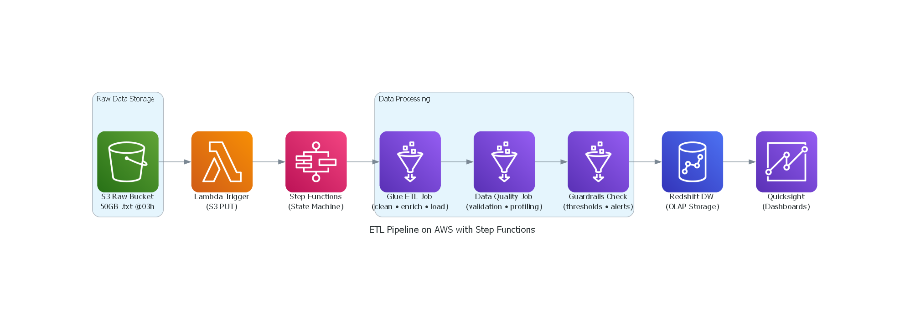

# txt 50GB

- [Cenário](#cenário)
    - [Tarefa](#tarefa)
    - [Entregáveis](#entregáveis)
- [Solução](#solução)
    - [Pipeline de Dados](#pipeline-de-dados)
    - [Descrição](#descrição)
    - [Observações](#observações)

## Cenário

Todo dia às 03h um arquivo `.txt` com 50GB é disponibilizado em um bucket S3, contendo informações de todas as operações que aconteceram no dia anterior. Esses dados precisam ser tratados 
e disponibilizados em um data warehouse para que os indicadores estejam disponíveis às 05h para os clientes consumirem.

### Tarefa

Monte a arquitetura de um pipeline que faça a ingestão, tratamento e disponibilização desses dados de forma estruturada para consumo via queries e via dashboard.

### Entregáveis

- Desenho da arquitetura contendo as ferramentas utilizadas  
- Breve descrição do motivo da escolha das ferramentas

---

## Solução

### Pipeline de Dados

### Descrição

Considerando que o arquivo é armazenado no S3, é interessante uma abordagem utilizando a arquitetura AWS.

Para trigger do processo será utilizada uma Lambda Function que monitora o bucket para verificar quando um novo arquivo chega.

Como orquestrador de fluxo será utilizado o Step Functions:
- Após o início do fluxo, o arquivo é processado via Glue Job, onde será feito o processo de ETL.
- O próximo passo é a aplicação de um processo de Data Quality (Utilizando o Glue também).
- Antes de salvar os arquivos no banco, é importante uma validação com guardrails, evitando o deploy de uma tabela com dados incorretos.
- Por fim, a tabela é criada no Data Warehouse (Redshift neste exemplo).

Como ferramenta de BI, seria interessante o uso do Amazon QuickSight, pensando na integração, pois é possível plugar direto no Redshift e manter tudo na mesma arquitetura cloud.

### Observações:

- As queries podem ser realizadas no Query Editor do Redshift, que aceita o padrão SQL.
- Escolhi o Glue pois acredito ser a melhor ferramenta para isso, além de ser pouco complexo de configurar e fácil de agendar (scheduler).
- O Redshift foi escolhido pensando no volume de dados e na necessidade de ETL. Faz sentido manter em um banco com persistência de dados, além da necessidade de queries e conexão 
com ferramentas de BI. Como ele é dedicado, oferece baixa latência e bom suporte para alta concorrência.
- O QuickSight foi escolhido por sua facilidade de integração e por manter tudo dentro do ecossistema AWS.
