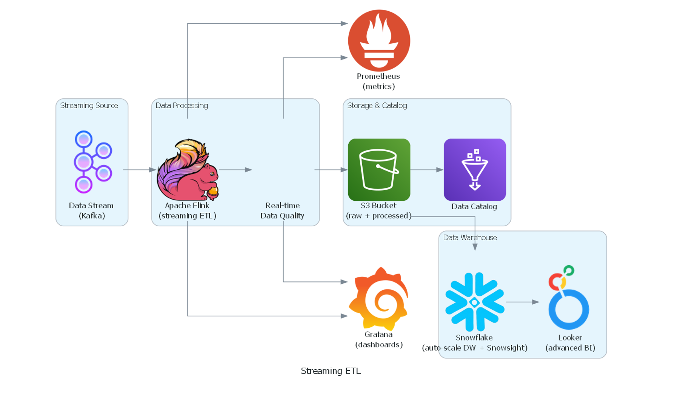

# B3 Streaming Data

- [Cenário](#cenário)
    - [Tarefa](#tarefa)
    - [Entregáveis](#entregáveis)
    
- [Solução](#solução)
    - [Pipeline de Dados](#pipeline-de-dados)
    - [Descrição](#descrição)

## Cenário

Os valores de ativos listados na B3 são disponibilizados em tempo real em um tópico Kafka para consulta. Esses dados precisam estar disponíveis para a área de investimento conseguir tomar as decisões de compra ou venda de ativos.

### Tarefa

Monte a arquitetura de um pipeline que faça a ingestão, tratamento e disponibilização desses dados de forma estruturada para consumo via queries e via dashboard.

### Entregáveis

- Desenho da arquitetura contendo as ferramentas utilizadas  
- Breve descrição do motivo da escolha das ferramentas

---
## Solução

### Pipeline de Dados

### Descrição

Pra esse case a ideia é utilizar o Flink para tratar os dados em streaming disponibilizados e armazenar eles diretamente no S3 (AWS), pensando em capacidade de armazenamento e menor complexidade de processo. 

O Grafana e o Prometheus seriam utilizados para monitoramento e logs do Flink.

Como data warehouse, a escolha seria o snowflake. Ele consegue se conectar ao S3, facilitando a ingestão dos dados, com escalabilidade automática, separação de armazenamento e computação, e excelente desempenho em cenários de alta concorrência.

Além disso, suporta cargas de trabalho mistas (consultas analíticas e dashboards). E para visualização seria o Looker, é altamente escalável, permite a criação de dashboards e é melhor recomendado para análises complexas (considerando que análises para compra e venda de ativos muitas vezes demandam essas análises).

